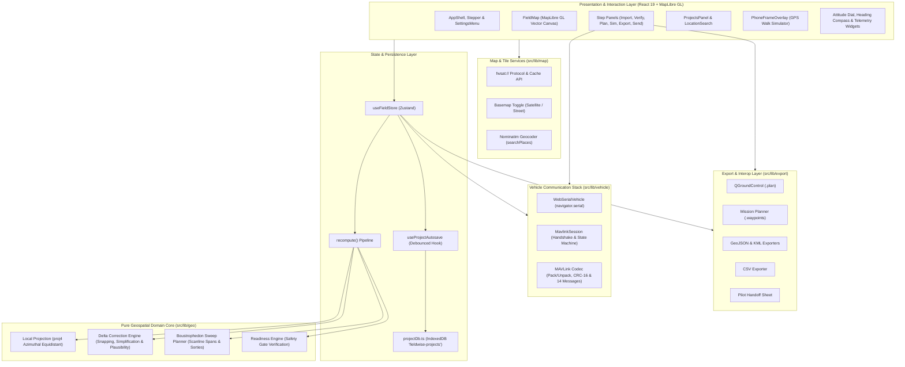
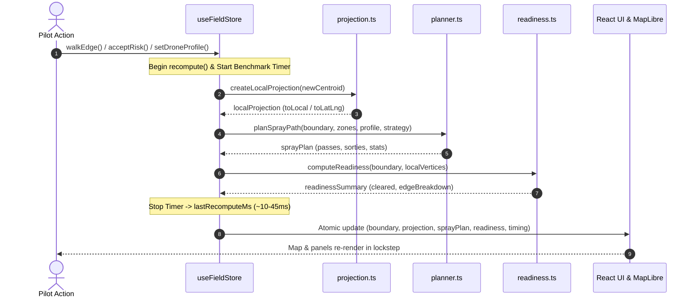

# FieldWise — Architecture Specification

This document details the software architecture, modular boundaries, data flows, and design patterns governing the FieldWise platform.

---

## 1. Architectural Principles

1. **Zero-Cloud Dependency (Offline by Design):** All computational geometry, coordinate transformations, flight plan generation, delta correction merging, and autopilot protocol serializations take place entirely client-side inside the pilot's browser. No round-trip API calls to external cloud servers are permitted for core planning or flight execution.
2. **Pure Domain Core:** Code residing under `src/lib/geo/`, `src/lib/export/`, and `src/lib/simulation/` is strictly decoupled from UI frameworks (no React hooks, no DOM manipulation, no browser-specific window global assumptions outside of the vehicle transport driver). Pure functions ensure 100% determinism and high testability.
3. **Synchronous Atomic Recompute:** When boundary points change or adjustments are made, all derived states (local metric projection, swath geometry, sortie partitions, and flight readiness) are recomputed atomically in a single pass (`recompute()` in `useFieldStore.ts`), eliminating intermediate or stale states between render frames. Recomputations complete in ~10–45 ms.
4. **Sub-Second Performance SLA:** Geometry operations on fields up to 50 hectares with complex exclusion zones must calculate in less than 1.5 seconds on commodity laptop CPUs.
5. **Fail-Closed Safety Gate:** The flight controller hardware interface and mission upload commands remain locked unless all boundary segments satisfy the readiness invariant (`readiness.cleared === true`).
6. **Local-First Session Persistence:** Project snapshots are stored in browser-local IndexedDB storage and synchronized via debounced autosave, ensuring work is never lost between sessions without relying on a remote database.

---

## 2. High-Level System Architecture



---

## 3. Subsystem Breakdown

### 3.1. Pure Geospatial Domain Core (`src/lib/geo/`)
* **`projection.ts`:** Creates a custom local Azimuthal Equidistant (AEQD) projection centered dynamically on the boundary's centroid (`approximateCentroidLatLng`) using `proj4`:
  $$\text{`+proj=aeqd +lat_0=}\phi_0\text{ +lon_0=}\lambda_0\text{ +x_0=0 +y_0=0 +datum=WGS84 +units=m +no_defs'}$$
  Converts geodetic coordinates to local Euclidean metric coordinates ($[x, y]$ in meters). AEQD preserves true ground distances from the origin and exhibits negligible distortion ($< 0.1\%$) across field operational scales.
* **`delta.ts`:** Implements boundary edge delta merging:
  1. *Simplification:* Applies Douglas-Peucker simplification to walked traces with tolerance tied to claimed GPS accuracy: $\max(2\text{ m}, 1.5 \times \text{accuracyM})$, preventing vertex count explosion.
  2. *Topological Validation:* Checks for self-intersections across the assembled ring using Turf `kinks`.
  3. *Plausibility Guard:* Calculates perpendicular distance from the original edge segment. If any point deviates farther than $0.2 \times \text{bounding\_box\_diagonal}$ (minimum 15 m), the edit is rejected to prevent interior wander spikes.
  4. *Untouched Vertex Invariant:* Retains untouched boundary vertices bit-exact without passing them through lossy back-and-forth projection cycles.
* **`planner.ts`:** Implements the boustrophedon sweep planner:
  1. Rotates sprayable multi-polygons (with no-spray exclusion zones subtracted) into sweep space by $-\theta_{\text{heading}}$.
  2. Evaluates scanline intersections (`scanlineSpans`) at regular swath intervals: $y_{\text{step}} = \text{swathM} \times (1 - \text{overlapFraction})$.
  3. Orders segments in alternating boustrophedon raster with explicit non-spraying transit connectors.
  4. Rotates paths back by $+\theta_{\text{heading}}$ and splits continuous passes into sorties based on tank capacity and battery endurance limits (`droneProfile.ts`).
* **`readiness.ts`:** Evaluates all edges of the active boundary:
  - Edges with `provenance.kind === 'satellite'` that lack `acceptedRisk: true` are marked as unverified.
  - Generates a `ReadinessSummary` containing `cleared` boolean, `totalEdges`, `unverifiedEdges`, `unverifiedLengthM`, `acceptedRiskEdges`, and `blockingEdgeIds`.

### 3.2. State Management & Persistence Pipeline (`src/store/` & `src/lib/storage/`)
* **`useFieldStore.ts`:** Central Zustand store maintaining session state. Any mutation affecting the boundary, zones, drone profile, or sweep strategy executes the synchronous `recompute()` pipeline:



* **`useProjectAutosave.ts`:** Debounced (600 ms) hook that listens to store changes and persists a `ProjectSnapshot` to IndexedDB via `projectDb.ts`. Restores the active project on initial load without writing empty projects during idle visits.
* **`projectDb.ts` & `project.ts`:** Pure record functions and asynchronous IndexedDB storage layer for project records (`id`, `name`, `createdAt`, `updatedAt`, `snapshot`).

### 3.3. Map & Tile Services (`src/lib/map/`)
* **`resilientSatelliteTiles.ts`:** Registers the custom `fwsat://` protocol in MapLibre GL:
  - Directs tile requests to the browser's Cache API (`fieldwise-satellite-tiles-v1`).
  - Detects Esri's 200 OK "Map data not yet available" placeholder images by byte length.
  - Automatically falls back to OpenStreetMap raster tiles if Esri fails or returns placeholders, emitting status to notify the UI banner.
* **`basemap.ts`:** Provides in-place switching between satellite imagery and OpenStreetMap street basemap without destroying other map vector layers.
* **`geocoding.ts`:** Integrates OpenStreetMap Nominatim geocoding service for worldwide field searches with debounced input and bounding-box camera flying.

### 3.4. Vehicle Link & MAVLink Communication (`src/lib/vehicle/`)
* **Web Serial Transport (`webSerialVehicle.ts`):** Direct hardware transport using `navigator.serial` at 115,200 baud.
* **MAVLink Codec & Messages (`src/lib/vehicle/mavlink/`):** Custom MAVLink 1.0 & 2.0 packet encoder and decoder supporting CRC-16-CCITT and `CRC_EXTRA` seeds across 14 message types:
  - `HEARTBEAT` (0), `SYS_STATUS` (1), `GPS_RAW_INT` (24), `ATTITUDE` (30), `GLOBAL_POSITION_INT` (33), `MISSION_REQUEST` (40), `MISSION_REQUEST_LIST` (43), `MISSION_COUNT` (44), `MISSION_ITEM_REACHED` (46), `MISSION_ACK` (47), `MISSION_REQUEST_INT` (51), `MISSION_ITEM_INT` (73), `VFR_HUD` (74), and `WIND` (168).
* **Live Telemetry Decoding:**
  - Battery voltage and remaining percentage (`SYS_STATUS`).
  - Altitude AGL, heading, airspeed (`VFR_HUD`).
  - Estimated wind speed and direction (`WIND`).
  - GPS fix status (2D, 3D, DGPS, RTK), visible satellites, and scaled HDOP (`GPS_RAW_INT`).
  - Roll and pitch angles (`ATTITUDE`) rendered via SVG artificial horizon dial and heading compass.
  - ArduCopter flight mode mapping (`ARDUCOPTER_MODE_LABELS`) and MAVLink system status (`MAV_STATE_LABELS`).
* **Mission Protocol Handshake:** Lockstep upload sequence (`MISSION_COUNT` ➔ `MISSION_REQUEST_INT` ➔ `MISSION_ITEM_INT` ➔ `MISSION_ACK`) followed by immediate byte-by-byte readback verification (`MISSION_REQUEST_LIST`).

### 3.5. Export & Interoperability Layer (`src/lib/export/`)
* **QGC Plan (`qgcPlan.ts`):** Produces QGroundControl `.plan` JSON with takeoff, waypoints, automated servo spray triggers (`MAV_CMD_DO_SET_SERVO`), and return-to-launch.
* **Mission Planner (`missionPlannerWaypoints.ts`):** Formats standard tabular `QGC WPL 110` text files for ArduPilot Mission Planner.
* **GIS Formats (`geojson.ts`, `kml.ts`, `csv.ts`):** Exports field geometries, exclusion buffers, and flight tracks with styled placemarks.
* **Pilot Handoff Briefing (`handoffSheet.ts`):** Printable briefing document with verification sign-off certificate, chemical load requirements, and sortie schedule.

---

## 4. Architectural Invariants

1. **Local Metric Invariant:** All internal spatial operations (buffering, pass generation, intersection tests, simplification) execute strictly in local Euclidean metric space ($x, y$ in meters). Geodetic coordinates ($lat, lon$) exist only at external boundaries: imports, exports, and map rendering.
2. **Provenance Rigor:** Every boundary edge holds a strongly-typed `EdgeProvenance` record:
   ```typescript
   export type ProvenanceKind = 'satellite' | 'walked' | 'confirmed'
   export interface EdgeProvenance {
     kind: ProvenanceKind
     imageryDate?: string
     accuracyM?: number
     verifiedAt?: string
     acceptedRisk?: boolean
   }
   ```
3. **Hardware Isolation:** UI components never interact with `navigator.serial` directly. All hardware communications funnel through the `VehicleLink` abstract interface, supporting mock serial sessions for Vitest testing and `WebSerialVehicle` in production.
4. **Local-First Storage Invariant:** Project data is saved to client-side IndexedDB only. No telemetry, spatial coordinates, or operator sign-off data is ever transmitted to an external server.
